# TP/TD Docker
#### Author: [Arthur PALY](https://github.com/ArthurMTX)
#### Professor: [Jean-Marc POUCHOULON]()
#### Date: 2023-04-05

## 3. Docker sous Linux
### 3.1. Installation de Docker sous Linux

1- Afin de voir la version de Docker, il faut taper la commande suivante : `docker version`. 
Voici ce qui est affiché : 
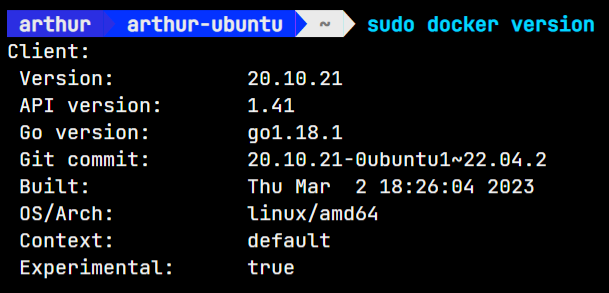

Afin d'avoir plus d'informations, notamment sur le daemon, il faut taper la commande suivante : `systemctl status docker`.
Voici ce qui est affiché :
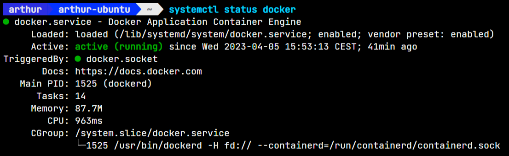

2- Afin de vérifier que Docker est bien installé, il faut taper la commande suivante : `docker run hello-world`.
Voici ce qui est affiché :
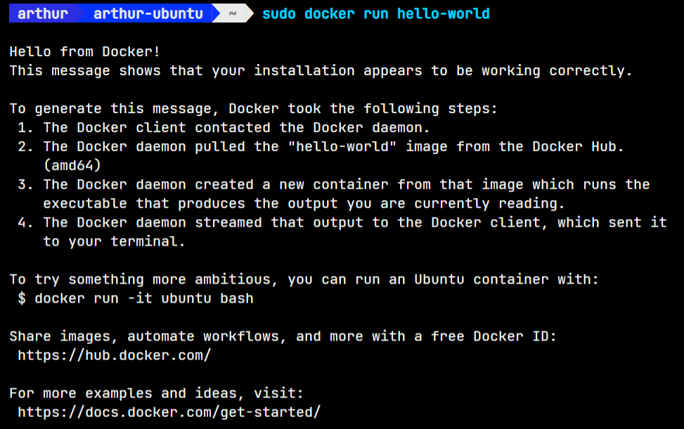

> a) 
> Cette commande nous explique que Docker est bien installé et fonctionnel. Le daemon est passé par le Docker Hub pour récupérer l'image `hello-world` et l'a lancé dans un conteneur. Le conteneur a ensuite affiché le message.

> b)
> Afin de retrouver l'image `hello-world`, sur le Docker Hub, il faut se rendre sur le lien suivant : [https://hub.docker.com](https://hub.docker.com) et taper `hello-world` dans la barre de recherche. Voici ce qui est affiché :
> 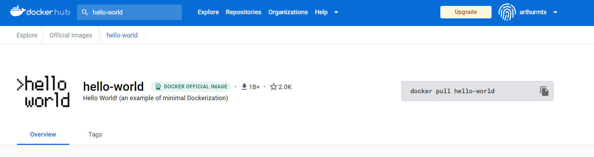

> c) 
> Les méchanismes en jeu pour la création du container `hello-world` sont les suivants :
> - Le daemon Docker a récupéré l'image `hello-world` sur le Docker Hub.
> - Le daemon Docker a créé un conteneur à partir de l'image `hello-world`.
> - Le daemon Docker a lancé le conteneur `hello-world`.
> Le fichier qui permet de créer le conteneur `hello-world` est le fichier `Dockerfile` qui se trouve dans le répertoire de l'image. 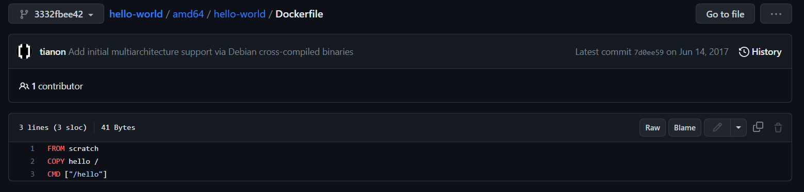

3- Afin de rechercher les images officielles de Debian, il faut taper la commande suivante : `docker search debian`. Pour les récupérer, il faut taper la commande suivante : `docker pull debian:latest`. Voici ce qui est affiché :
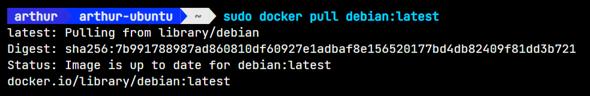 
Afin de récupérer busybox, il faut taper la commande suivante : `docker pull busybox:latest`. Voici ce qui est affiché :
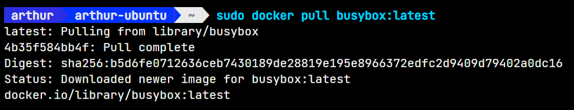

4- Pour créer un conteneur à partir de l'image Debian, il faut taper la commande suivante : `docker run -d debian`. Voici ce qui est affiché :
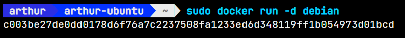

5- Dans la commande `docker ps`, le conteneur `debian` n'est pas affiché car aucun processus n'est lancé dans le conteneur. Voici ce qui est affiché :
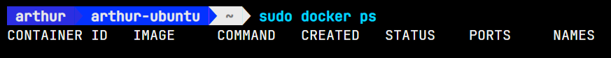

6- Afin de relancer le conteneur avec un argument, il faut effectuer la commande suivante : `docker run -d debian bash -c "while :; do echo "coucou" ; sleep 1; done"`. Voici ce qui est affiché :
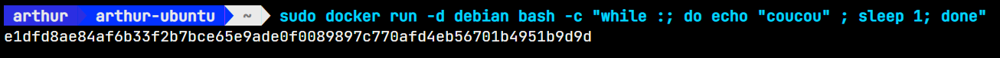

7- Pour stopper et redémarrer le conteneur, il faut taper les commandes suivantes : `docker stop e1dfd8ae84af` puis `docker start e1dfd8ae84af`. Voici ce qui est affiché :
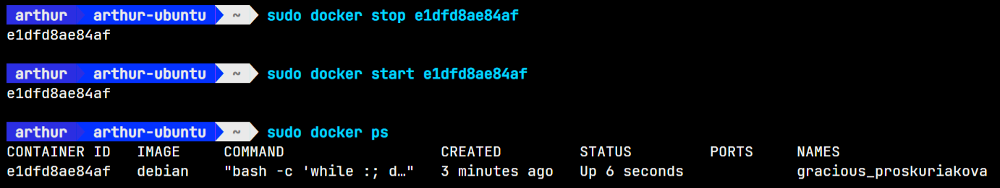

8- Pour supprimer le contener, d'abord le stopper puis taper la commande suivante : `docker rm e1dfd8ae84af`. Voici ce qui est affiché :
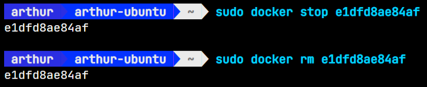

9- Afin d'être dans le container après son lancement, il faut taper la commande suivante : `docker run -it debian`. Voici ce qui est affiché :
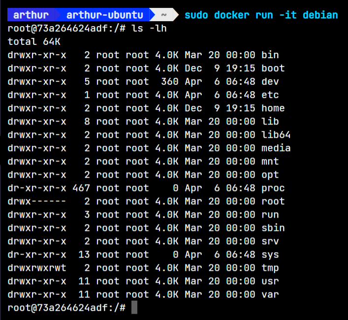

10- Pour faire la meme operation mais en nommant le container et le hostname, il faut taper la commande suivante : `docker run -it --name DebianOne --hostname DebianOne debian`. Voici ce qui est affiché :
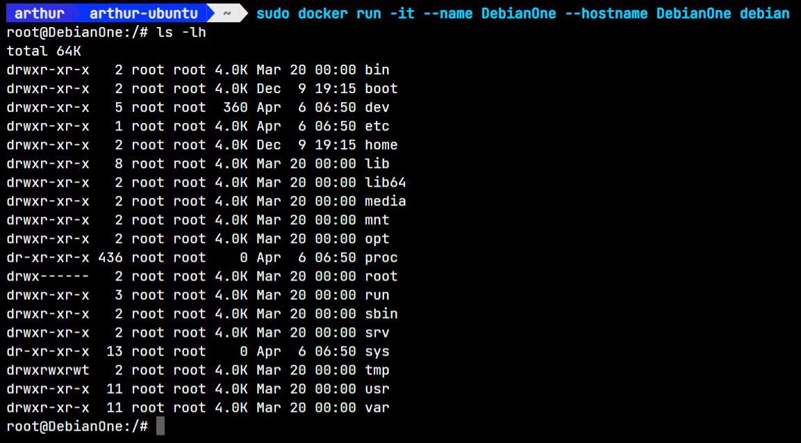

11- Pour se détacher du container sans l'arrêter, il faut taper la combinaison de touches `Ctrl + P puis Ctrl + Q`. Voici ce qui est affiché :
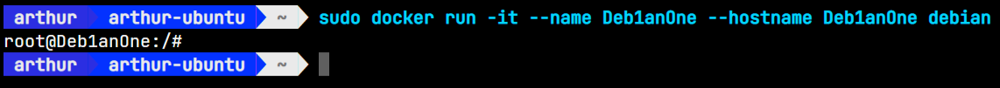 Pour se reconnecter au container, il faut taper la commande suivante : `docker attach DebianOne`. Voici ce qui est affiché :
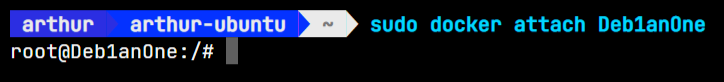

12- Pour exécuter un processus bash supplémentaire dans un container, il faut taper la commande suivante : `docker exec -it DebianOne bash`. Voici ce qui est affiché :


13- Pour lister le container restant, il faut taper la commande suivante : `docker ps -a`. Voici ce qui est affiché :
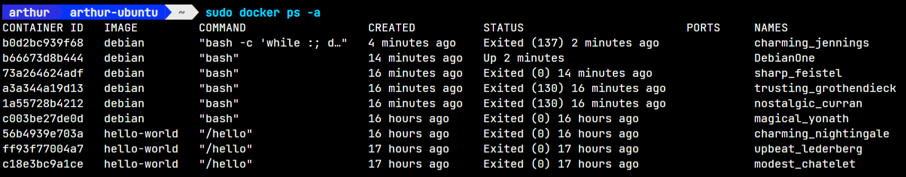
Pour lister un container via son ID, il faut taper la commande suivante : `docker ps -a -f id=b66673d8b444`. Voici ce qui est affiché :
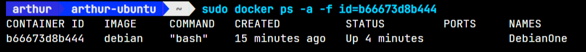

14- Pour donner a un container accès a un répertoire de l'hôte, il faut taper d'abord créer un volume avec la commande suivante : `docker volume create debian_test`. Puis taper la commande suivante : `docker run -it -v debian_test:/home debian`. Voici ce qui est affiché : 
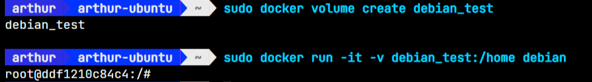
Afin de lister les volumes, il faut taper la commande suivante : `docker volume ls`. Voici ce qui est affiché :
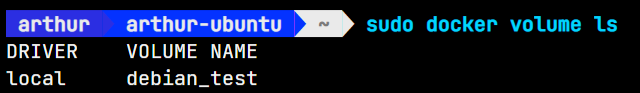

15- Pour supprimer le container, il faut taper la commande suivante : `docker rm -f DebianOne`. Voici ce qui est affiché : 
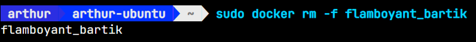
Pour supprimer une image, il faut taper la commande suivante : `docker rmi debian`. Voici ce qui est affiché :
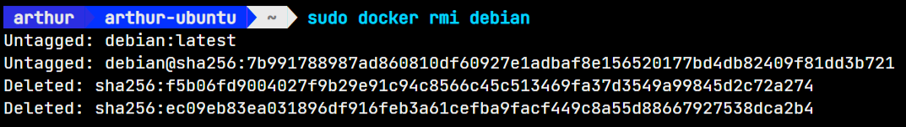

16- Pour supprimer tout les containers, il faut taper les commandes suivantes : `docker rm -f $(docker ps -a -q)`. Voici ce qui est affiché :
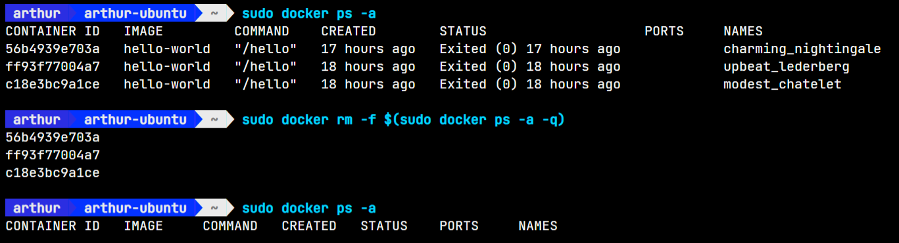

17- Pour supprimer les images et les containers non utilisés, il faut taper la commande suivante : `docker system prune`. Voici ce qui est affiché : 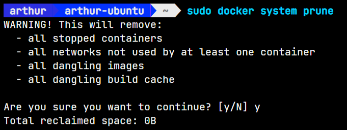

## 4. Création d'images Docker
### 4.1. Build d’une image Docker Debian

1- Pour construire une image a partir d'un Dockerfile, il faut taper la commande suivante : `docker build -t debian:mtx <path>`. Voici ce qui est affiché :
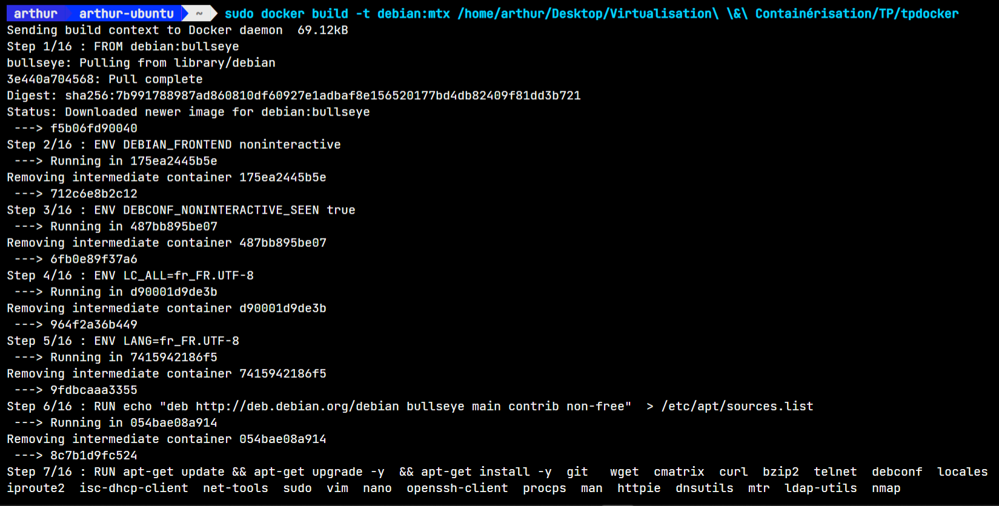

2- La commande RUN permet de lancer une commande dans le container, dans ce cas là, elle paramètre la source list afin de pouvoir installer les paquets.
La commande ENV permet de définir les variables d'environnement du container.
La commande FROM permet de définir l'image de base du container.

3- L'intérêt de faire tout les apt-get update et apt-get install dans un seul RUN est de limiter le nombre de couches de l'image. En effet, chaque RUN crée une nouvelle couche dans l'image. Si on fait tout les apt-get dans un seul RUN, on aura qu'une seule couche dans l'image.

4- Dockerfile :
```Dockerfile
FROM debian:mtx
RUN apt-get update && apt-get install -y iputils-ping
ENTRYPOINT ["ping", "-c", "4", "www.iutbeziers.fr"]
```
Voici la commande utilisée pour créer l'image :
`sudo docker build -t pingfour -f Dockerfile.pingfour .`. Voici ce qui est affiché :
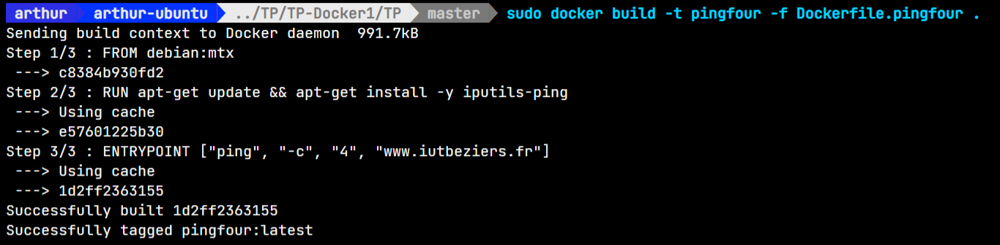

5- Pour créer un container à partir de l'image, il faut taper la commande suivante : `docker run --rm -it pingfour`. Voici ce qui est affiché :
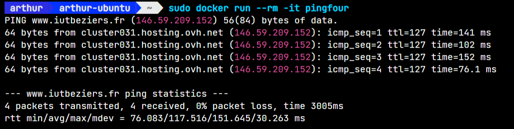
Le `--rm` supprime le container une fois qu'il est arrêté.

6- Pour changer la destination du ping et le nombre de ping, il faut changer ENTRYPOINT dans le Dockerfile. Voici le nouveau Dockerfile :
```Dockerfile
FROM debian:mtx
RUN apt-get update && apt-get install -y iputils-ping
CMD ["ping", "-c", "4", "www.iutbeziers.fr"]
```
Ensuite, il faut rebuild et lancer le container via cette commande ``docker run --rm -it pingfour:beta ping www.mtx.dev -c 10`` Voici ce qui est affiché :
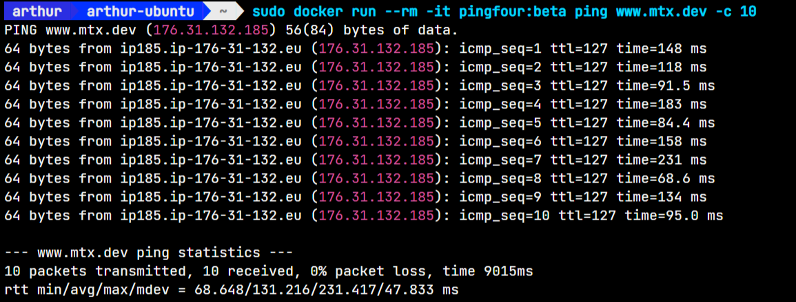

7- Pour changer la commande ping par traceroute il faut ajouter le paquet traceroute dans le Dockerfile. Voici le nouveau Dockerfile :
```Dockerfile
FROM debian:mtx
RUN apt-get update && apt-get install -y iputils-ping traceroute
ENTRYPOINT ["ping", "-c", "4", "www.iutbeziers.fr"]
``` 
Ensuite, via l'argument `--entrypoint`, il faut taper la commande suivante : `docker run --rm -it --entrypoint traceroute pingfour:traceroute www.mtx.dev`. Voici ce qui est affiché :
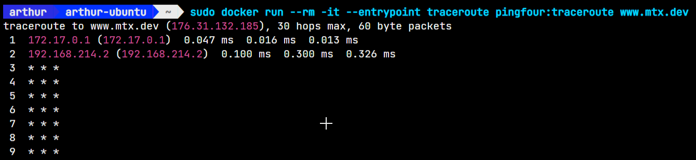

8- Pour commit une image, il faut taper la commande suivante : `docker commit pingfour`. Voici ce qui est affiché :
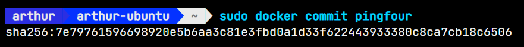

### 4.2. Installation d’un "insecure registry" sur votre poste de travail

Pour créer un insecure registry, il faut éditer le fichier `daemon.json` qui se trouve dans le dossier `/etc/docker/`. Voici ce qui est affiché :
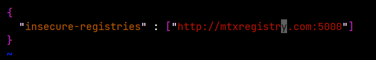
Ensuite, il faut redémarrer le service docker avec la commande suivante : `sudo systemctl restart docker`. Pas besoin de se login car il n'y pas de certificat.
Il faut d'abord lancer le registry avec la commande suivante : `docker run -d -p 5000:5000 --restart=always --name MTXRegistry registry:2`. Voici ce qui est affiché :
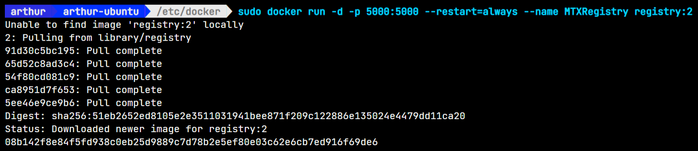

Pour envoyer une image sur le registry, il faut taper la commande suivate : `docker push localhost:5000/pingfour`. Voici ce qui est affiché :
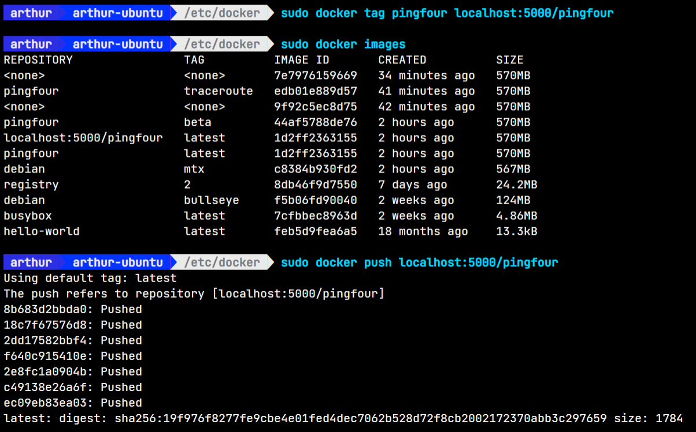

Pour récupérer une image du registry, il faut taper la commande suivante : `docker pull localhost:5000/pingfour`. Voici ce qui est affiché :
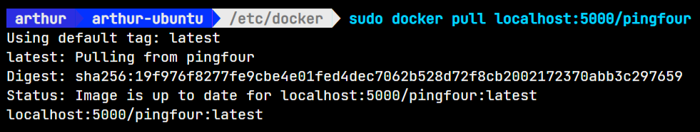

### 4.3 Création d’un Dockerfile afin de générer une image Debian SSH

```Dockerfile
FROM registry.iutbeziers.fr/debianiut

RUN apt-get update && apt-get install -y openssh-server

RUN mkdir /var/run/sshd

RUN echo 'root:mon_mot_de_passe' | chpasswd

EXPOSE 2222

CMD ["/usr/sbin/sshd", "-D", "-e", "-f", "/etc/ssh/sshd_config"]
```
